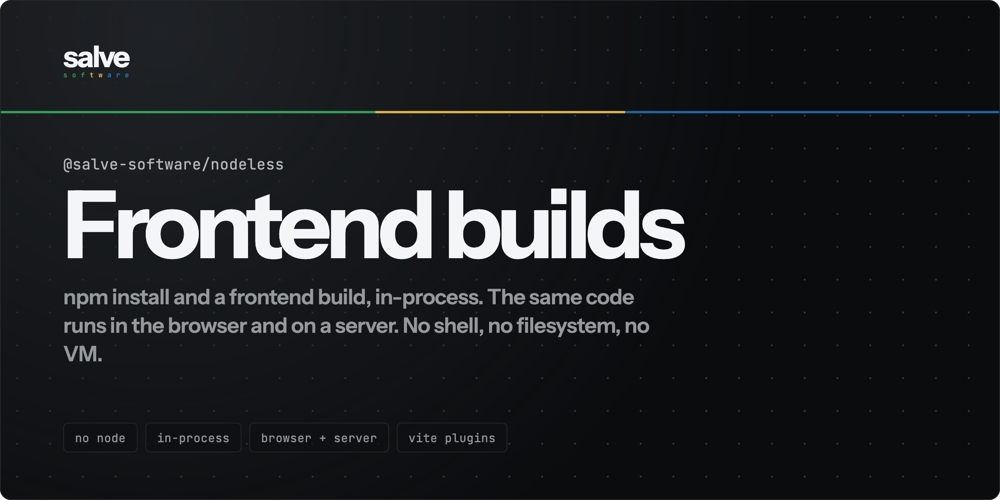

<p align="center">
  
</p>

<p align="center">
  
  
  
  
  
</p>

Give it a map of files. It installs the dependencies from npm, runs the project's own
`vite.config.ts` and its plugins, and hands back `index.html`, `bundle.js` and `bundle.css`.
All in memory, in the same process. No shell, no filesystem, no child process, no VM.

It works because a project has two module graphs and they are disjoint.

The **application** graph is your `src/` and the packages it imports. It is read as text and
never executed, because resolving an import and transpiling TSX do not run anything.

The **config** graph is your `vite.config.ts` and the plugins it imports. That one is executed,
in a sandbox where `node:fs` is the virtual filesystem and there is no disk to reach.

That second part is why a toolchain nodeless has never heard of costs no code here.

<p align="center">
  
</p>

```ts
import { NodelessProject } from '@salve-software/nodeless';

const project = new NodelessProject({
  files: {
    '/package.json': '{ "dependencies": { "react": "^19.0.0", "react-dom": "^19.0.0" } }',
    '/src/main.tsx': "import { createRoot } from 'react-dom/client'; /* ... */",
  },
});

await project.install();

const result = await project.build();

if (result.ok) {
  iframe.srcdoc = new TextDecoder().decode(result.files['index.html']);
} else {
  console.error(result.errors); // { text, file, line, column }
}
```

## Features

- **Your app's code never runs.** Not during install, not during build. No `postinstall`, no
  `package.json` scripts.
- **Your Vite config does run.** Plugins from npm, virtual modules, `define`, `resolve.alias`
  and `defineConfig(({ mode }) => …)` all work, without nodeless knowing what any of them are.
- **A real npm install.** Semver ranges, integrity checks, npm's flat layout, a lockfile.
- **Works in the browser.** A headless Chromium job in CI proves it, end to end.
- **Errors are data.** Failed builds return `{ ok: false, errors }` with file, line and column.
- **Fast enough to skip the dev server.** About 200 ms for a React scaffold.
- **Toolchains just work.** Tailwind and Sass compile with no configuration. CSS modules too.
- **Preview before installing.** `build({ cdn })` points unresolved imports at a CDN.

## Install

```bash
npm install @salve-software/nodeless
```

Node 20 or higher, or any browser with `fetch` and WebAssembly. The packages you build have to be
pure JS.

## Usage

### Build

```ts
const result = await project.build({ mode: 'development' });
```

`files` comes back as `Record<string, Uint8Array>`. `build()` never writes to the VFS, which is
what lets `watch()` run without a build triggering itself.

| Option       | Default                             |
| ------------ | ----------------------------------- |
| `entry`      | the first `src/main.*` that exists  |
| `mode`       | `'production'`                      |
| `html`       | `/index.html`                       |
| `outdir`     | `/dist`                             |
| `target`     | `'es2020'`                          |
| `conditions` | `browser, import, module, default`  |
| `external`   | `[]`                                |
| `cdn`        | off                                 |
| `publicDir`  | `/public`                           |
| `assetLimit` | `4096` bytes                        |
| `env`        | `{}`, merged into `import.meta.env` |
| `plugins`    | `[]`, esbuild plugins, run first    |

`mode: 'development'` turns minification off and inline sourcemaps on.

`publicDir` is copied to the output as is. Assets over `assetLimit` become their own file under
`assets/` instead of a data URL, which is the threshold Vite uses. `import.meta.env` is defined
with `MODE`, `DEV`, `PROD`, `BASE_URL` and `SSR`, plus whatever `env` adds.

`compilerOptions.paths` from `/tsconfig.json` are honoured, so `@/components/button` resolves
the way TypeScript would. `resolve.alias` from the config wins over them.

### The project's config

If the project has a `vite.config.ts`, or `.mts`, `.js`, `.mjs`, `.cjs`, or a
`nodeless.config.*`, it is executed and its `plugins`, `define`, `resolve.alias`, `base` and
`build.outDir` are applied. A project without one builds exactly as it did before, on the same
code path and at the same cost.

```ts
// vite.config.ts, in the project you are building
import react from '@vitejs/plugin-react';
import { readFileSync } from 'node:fs';

export default ({ mode }) => ({
  plugins: [react(), { name: 'banner', transform: (code, id) => /* … */ }],
  define: { __VERSION__: JSON.stringify(JSON.parse(readFileSync('/package.json', 'utf8')).version) },
  resolve: { alias: { '~': '/src' } },
});
```

`node:fs` there is the VFS. `node:path`, `node:url`, `node:process`, `node:crypto`,
`node:module` and the rest are the same. All of them are implemented against the virtual
filesystem, not forwarded to a real one. `child_process`, `net` and their neighbours import without complaint
and throw the moment something calls them, so a dead code path cannot take your build down.

The config is run once per mode and cached, so a `watch` rebuild costs what it always did.
Editing the config file invalidates it, which is why Vite restarts on one too.

#### Where the config runs

A config is code, and in a playground it is code somebody else typed. `isolation` decides
where it is evaluated:

| Mode                 | Where                      | Isolation                                                                                                     |
| -------------------- | -------------------------- | ------------------------------------------------------------------------------------------------------------- |
| `'none'` _(default)_ | in-process, `new Function` | builtins are unreachable; the page's globals are not                                                          |
| `'worker'`           | a Worker, browser only     | no DOM, no `localStorage`, no cookies, and `fetch`, `indexedDB` and `caches` are deleted before anything runs |

```ts
new NodelessProject({ files, isolation: 'worker' });
```

Both modes rewrite every `node:fs` to the VFS shim **at bundle time**, so neither can reach a
real filesystem. That part is not what `isolation` buys. What it buys is distance from the
page. Use `'worker'` whenever the config is not yours.

The worker entry ships bundled and self-contained, so there is nothing extra to serve. Pass
`workerUrl` if your bundler moves it.

**Plugins use the Rollup and Vite hook shape**, which is what the ecosystem already writes
against: `resolveId`, `load`, `transform`, `configResolved`, and `enforce: 'pre' | 'post'`.
`resolveId` and `load` stop at the first plugin that claims a module; `transform` is a pipeline.
`this` is the plugin context, with `vfs` and a `resolve` rooted where you are standing.

### Toolchains

Nothing to configure. A stylesheet using Tailwind directives is compiled, and so is a `.scss`
file:

```ts
await project.install({ dev: ['tailwindcss'] });
await project.build();
```

Both are **optional peer dependencies**, imported only once a file is found to need them, and
both are ordinary plugins with `enforce: 'post'`, so a config that brings `@tailwindcss/vite`
leaves them nothing to claim. The engine comes from the package next to nodeless; the files come
from the VFS, which is why Tailwind has to be installed into the project like any dependency.

The built-in Tailwind plugin refuses `@plugin` and `@config`, because those point at JavaScript
and it does not run any. Put `@tailwindcss/vite` in a config instead: that path goes through the
runtime, and it can.

### Adding your own

Pass a plugin to the project, or put one in the config. Same shape either way:

```ts
new NodelessProject({
  files,
  plugins: [
    {
      name: 'svgr',
      transform: (code, id) =>
        id.endsWith('.svg') ? { code: toReactComponent(code), loader: 'tsx' } : null,
    },
  ],
});
```

Yours run first, then the project config's, then the built-ins. Returning `null` means "not
mine" and passes the module along.

### Install

```ts
const { installed, warnings, lockfile } = await project.install({ dev: ['tailwindcss'] });
```

Reads `dependencies` from `/package.json` and writes the packages into `/node_modules`.

`dev` brings in `devDependencies`, which is where a Vite project keeps its CSS toolchain. Name
the ones you want: `true` takes all of them, and on a real Vite project that is 165 packages and
65 MB to get the one you were after.

A package listed under `workspaces` is taken from the VFS instead of the registry. A package
that cannot be resolved at all becomes a `warnings` entry rather than failing the whole install,
so one private dependency does not cost you the other twelve. Peers are reported the same way
and never installed for you.

### In the browser

The published `dist/` has four bare imports and needs no build step, so an import map covers it.
Pass a `wasmURL` and the rest is identical.

```html
<script type="importmap">
  {
    "imports": {
      "esbuild-wasm": "https://unpkg.com/esbuild-wasm@0.28.2/esm/browser.min.js",
      "resolve.exports": "https://esm.sh/resolve.exports@2.0.3",
      "semver": "https://esm.sh/semver@7.8.5",
      "fflate": "https://esm.sh/fflate@0.8.3"
    }
  }
</script>
```

```ts
new NodelessProject({
  files,
  wasmURL: 'https://unpkg.com/esbuild-wasm@0.28.2/esbuild.wasm',
});
```

esbuild-wasm runs its own worker, so the build doesn't block the UI.

## Playground

```bash
npm run playground
```

An editor with a live preview next to it. It installs from npmjs.org in your browser, builds
there, and renders the result. The other examples live in [`example/`](example/README.md).

## What it doesn't do

**Native binaries**: `lightningcss`, `@swc/core`, `sharp`, embedded `sass`. A package with a
WASM build can be mapped to it; one without cannot run here at all.

**Output hooks**: `generateBundle` and `renderChunk` have nowhere to live, because esbuild's
plugin API has no output phase. A manifest, compression or legacy plugin will not work.

**Sourcemaps through a transform**: a plugin may return `map` and it is dropped, because
esbuild's `onLoad` takes no input sourcemap.

**Running real `vite build`**: it wants `worker_threads`, an HTTP server and native rollup.
Being compatible with Vite _plugins_ is what buys the coverage.

Also: `postinstall` and `package.json` scripts, and React Refresh. Full reasoning in
[`docs/design/06-scope-and-limits.md`](docs/design/06-scope-and-limits.md).

## Docs, contributing, license

[`docs/design/`](docs/design/README.md) has the decisions behind the code.
[CONTRIBUTING.md](./CONTRIBUTING.md) has setup and conventions. MIT, see
[LICENSE](./LICENSE).

<p align="center">
  Made by Salve Software
</p>
