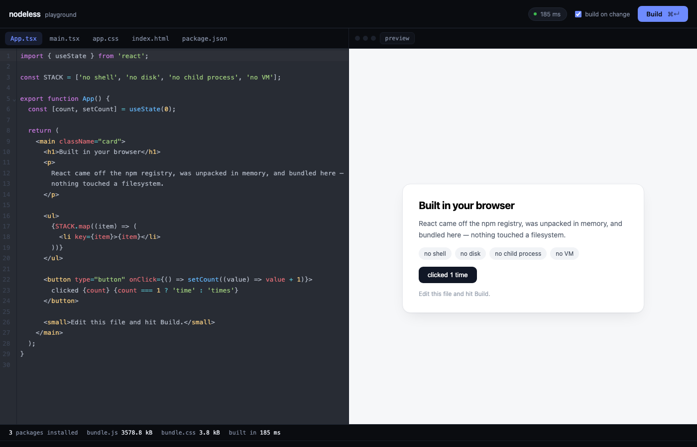

<h1 align="center">nodeless</h1>

<p align="center">
  <strong>npm install and a React build, without Node</strong>
</p>

<p align="center">
  
  
  
  
  
</p>

Give it a map of files. It installs the dependencies from npm and hands back `index.html`,
`bundle.js` and `bundle.css`, all in memory and in the same process. No shell, no filesystem, no
child process, no VM.

This works because a bundler never runs the code it bundles, and unpacking a tarball doesn't
either. The container people spin up to build on demand is guarding a step that was already
inert. Drop it and the same code runs on your server and in your user's browser.

<p align="center">
  
</p>

```ts
import { NodelessProject } from '@salve-software/nodeless';

const project = new NodelessProject({
  files: {
    '/package.json': '{ "dependencies": { "react": "^19.0.0", "react-dom": "^19.0.0" } }',
    '/src/main.tsx': "import { createRoot } from 'react-dom/client'; /* ... */",
  },
});

await project.install();

const result = await project.build();

if (result.ok) {
  iframe.srcdoc = new TextDecoder().decode(result.files['index.html']);
} else {
  console.error(result.errors); // { text, file, line, column }
}
```

## Features

- **Nothing gets executed.** Not your files, not `postinstall`, not `package.json` scripts.
- **A real npm install.** Semver ranges, integrity checks, npm's flat layout, a lockfile.
- **Works in the browser.** A headless Chromium job in CI proves it, end to end.
- **Errors are data.** Failed builds return `{ ok: false, errors }` with file, line and column.
- **Fast enough to skip the dev server.** About 200 ms for a React scaffold.
- **CSS modules built in, Tailwind if you want it.** `cssTransform` gets the stylesheet, the VFS
  and a resolver, which is enough to run Tailwind v4 in memory.
- **Preview before installing.** `build({ cdn })` points unresolved imports at a CDN.

## Install

```bash
npm install @salve-software/nodeless
```

Node 20 or higher, or any browser with `fetch` and WebAssembly. The packages you build have to be
pure JS.

## Usage

### Build

```ts
const result = await project.build({ mode: 'development' });
```

`files` comes back as `Record<string, Uint8Array>`. `build()` never writes to the VFS, which is
what lets `watch()` run without a build triggering itself.

| Option       | Default                            |
| ------------ | ---------------------------------- |
| `entry`      | the first `src/main.*` that exists |
| `mode`       | `'production'`                     |
| `html`       | `/index.html`                      |
| `outdir`     | `/dist`                            |
| `target`     | `'es2020'`                         |
| `conditions` | `browser, import, module, default` |
| `external`   | `[]`                               |
| `cdn`        | off                                |

`mode: 'development'` turns minification off and inline sourcemaps on.

`publicDir` is copied to the output as is. Assets over `assetLimit` become their own file under
`assets/` instead of a data URL, which is the threshold Vite uses. `import.meta.env` is defined
with `MODE`, `DEV`, `PROD`, `BASE_URL` and `SSR`, plus whatever `env` adds.

`compilerOptions.paths` from `/tsconfig.json` are honoured, so `@/components/button` resolves
the way TypeScript would.

### Install

```ts
const { installed, warnings, lockfile } = await project.install({ dev: true });
```

Reads `dependencies` from `/package.json` and writes the packages into `/node_modules`. Pass
`dev` to include `devDependencies`, which is where a Vite project keeps its CSS toolchain.

A package listed under `workspaces` is taken from the VFS instead of the registry. A package
that cannot be resolved at all becomes a `warnings` entry rather than failing the whole install,
so one private dependency does not cost you the other twelve. Peers are reported the same way
and never installed for you.

### In the browser

The published `dist/` has four bare imports and needs no build step, so an import map covers it.
Pass a `wasmURL` and the rest is identical.

```html
<script type="importmap">
  {
    "imports": {
      "esbuild-wasm": "https://unpkg.com/esbuild-wasm@0.25.12/esm/browser.min.js",
      "resolve.exports": "https://esm.sh/resolve.exports@2.0.3",
      "semver": "https://esm.sh/semver@7.8.5",
      "fflate": "https://esm.sh/fflate@0.8.3"
    }
  }
</script>
```

```ts
new NodelessProject({
  files,
  wasmURL: 'https://unpkg.com/esbuild-wasm@0.25.12/esbuild.wasm',
});
```

esbuild-wasm runs its own worker, so the build doesn't block the UI.

## Playground

```bash
npm run playground
```

An editor with a live preview next to it. It installs from npmjs.org in your browser, builds
there, and renders the result. The other examples live in [`example/`](example/README.md).

## What it doesn't do

Native bindings, `package.json` scripts, `postinstall`, Rolldown, lightningcss, `sharp`, embedded
`sass`, React Refresh. Most of that follows from the premise: a library that
executed code would need isolation, and isolation is the cost this one exists to remove. Full
reasoning in [`docs/design/06-scope-and-limits.md`](docs/design/06-scope-and-limits.md).

## Docs, contributing, license

[`docs/design/`](docs/design/README.md) has the decisions behind the code.
[CONTRIBUTING.md](./CONTRIBUTING.md) has setup and conventions. MIT, see
[LICENSE](./LICENSE).

<p align="center">
  Made by Salve Software
</p>
